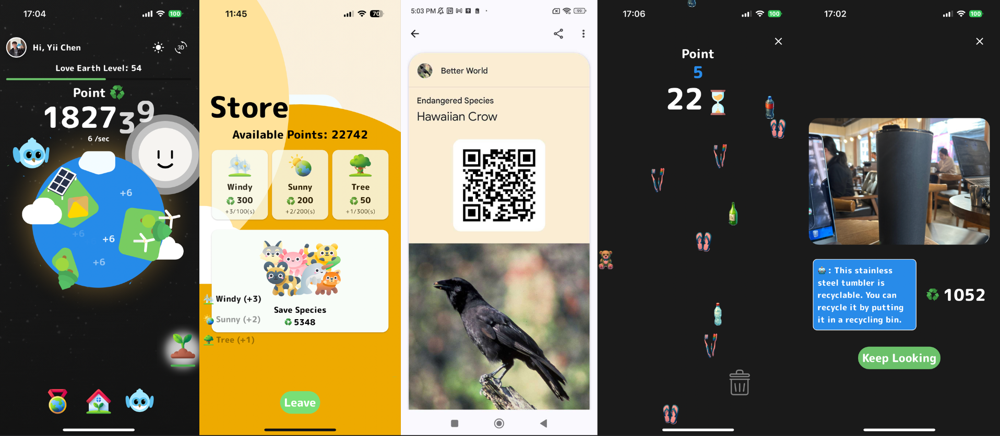

# Better World



**Engage kids in environmental care with our game!** Earn points through eco-challenges like Garbage Sorting, save endangered species, and watch the world grow greener with each action.

### 📺 Demo
[https://youtu.be/afh4jGIhhEg?si=b8-b2ijtE8x9zfJB](https://youtu.be/afh4jGIhhEg?si=b8-b2ijtE8x9zfJB)

### 🌎 Devpost
[https://devpost.com/software/better-world-i8l5sk](https://devpost.com/software/better-world-i8l5sk)

### 🕹️ Play
Android - [https://drive.google.com/file/d/1QWSD3h35g5e2BoWvAZmo6YWLMZ4Ezkp1/view?usp=sharing](https://drive.google.com/file/d/1QWSD3h35g5e2BoWvAZmo6YWLMZ4Ezkp1/view?usp=sharing) \
iOS - [https://appstoreconnect.apple.com/apps/6478499075/testflight/ios/6e8c08e4-7b3d-414d-91cc-d9a6fc6c4291](https://appstoreconnect.apple.com/apps/6478499075/testflight/ios/6e8c08e4-7b3d-414d-91cc-d9a6fc6c4291) \
macOS - [https://appstoreconnect.apple.com/apps/6478499075/testflight/ios/6e8c08e4-7b3d-414d-91cc-d9a6fc6c4291](https://appstoreconnect.apple.com/apps/6478499075/testflight/ios/6e8c08e4-7b3d-414d-91cc-d9a6fc6c4291) \
Web - [envawareness-game.firebaseapp.com](envawareness-game.firebaseapp.com)

---

## Concept and Inspiration
**Better World** originated from our awareness of escalating environmental issues and the crucial role of early education in fostering responsible environmental stewardship. We aspired to create a platform that educates and empowers children, making environmental conservation an engaging and enjoyable part of their learning experience.

## Game Design and Educational Strategy
The game is an interactive idle experience designed for children, using simple click-based interactions to make it accessible to a broad age range. It incorporates educational mini-games on recycling and energy conservation, employing intuitive gameplay and real-world technology integration to teach important environmental concepts. Key educational components include:

1. **Sorting and Catching Trash:** These mini-games teach waste segregation and recycling awareness through interactive gameplay.
2. **Scanning Trash and Appliances:** Utilizing camera and AI technology, these activities connect learning with real-world application, teaching children to identify recyclable materials and understand energy efficiency.

We've also integrated Google Wallet to transform the cards collected in the game into digital collectibles, adding a tangible value to the players' achievements. Moreover, the game's focus on featuring endangered animals as collectibles serves a dual purpose: it not only enhances the gaming experience but also raises awareness about wildlife conservation, aiming to foster a deeper connection between players and environmental protection efforts.

## Technical Development
We developed **Better World** using Flutter, emphasizing interactive and educational game elements with Canvas Widget and Lottie Animations. Gemini AI played a pivotal role in enhancing user interaction, linking in-game actions with real-world contexts.

## Multiple Platform Support
**Better World** can run on mobile, desktop, and web. We hope everybody can play on which platform they like. Also, shows how powerful Flutter is.
- iOS - TestFlight to play (store version is in review) [link](https://appstoreconnect.apple.com/apps/6478499075/testflight/ios/6e8c08e4-7b3d-414d-91cc-d9a6fc6c4291)
- Android - APK link to play (store version in review) [link](https://drive.google.com/file/d/1W1urHskSz4CExiHfgyALQQ3dmRsxQwOD/view)
- Web - link to play [link](https://envawareness-game.firebaseapp.com/)
- macOS - (open test and store versions are in review) [link](https://appstoreconnect.apple.com/apps/6478499075/testflight/ios/6e8c08e4-7b3d-414d-91cc-d9a6fc6c4291)

## Challenges and Learning
Balancing educational content with engaging gameplay was our main challenge, ensuring the game remains enjoyable while providing substantive learning. We focused on creating child-friendly UIs and capitalized on Flutter for consistent cross-platform performance.

## Achievements and Impact
We are proud of creating an app that combines educational value with engaging gameplay, facilitating impactful learning about sustainability. Key achievements include:

- Integrating AI and camera technologies for an immersive learning experience.
- Designing a user-friendly and technologically advanced platform suitable for children.
- Observing children's enhanced understanding and appreciation of environmental conservation.

## Future Directions
To further enrich **Better World**, we aim to:

- Expand educational content and incorporate more dynamic animations.
- Address resource and manpower limitations encountered during development.
- Collaborate with environmental organizations to introduce new mini-games.
- Broaden the environmental topics covered, ensuring a well-rounded educational experience.

---

## Feature
- [x] Firebase OAuth Sign-in
- [x] Firebase Firestore 
- [x] Welcome Slider
- [x] ZFlutter 3D UI
- [x] Tapping Effect
- [x] Global Leaderboard
- [x] Google Wallet for Collection
- [x] Slide to Recycle Game
- [x] Catch Trash Game
- [x] Gemini AI Interaction
- [x] L10n Support(English, Japanese, Chinese) 

---

## Setup

### Firebase
- add "**google-services.json**" file in `android/app/`
- add "**GoogleService-Info.plist**" file in `ios/Runner/`
- add  "**firebase_app_id_file.json**" file in `ios/`
- add "**firebase_options.dart**" file in `lib/`

#### Firestore

waiting for details..

### AI Studio - Gemini AI
Need API key for using AI feature.

## Run
```
flutter run --dart-define AI_API_KEY=<YOUR_KEY>
```

## Build

**Web**
```
flutter build web --web-renderer canvaskit --dart-define AI_API_KEY=<YOUR_KEY>
```

---

## Team Members

Yii Chen            | Dorara
:-------------------------:|:-------------------------:|
  |  
